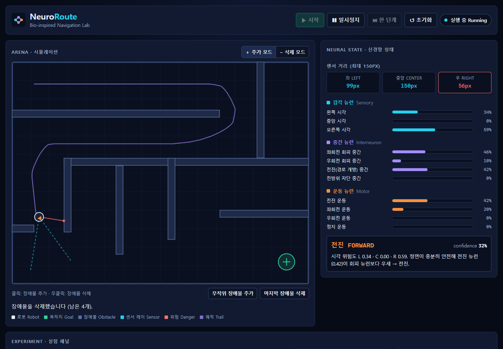
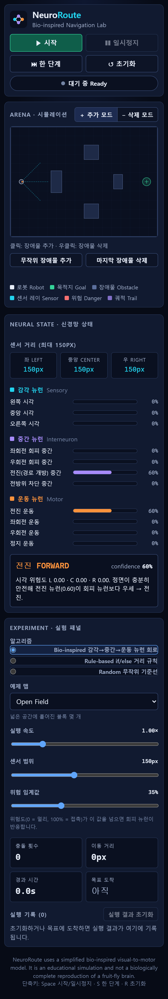

# NeuroRoute — Bio-inspired Navigation Lab

NeuroRoute는 초파리(*Drosophila melanogaster*)의 시각-운동 회로에서 **아이디어를 빌려 온** 장애물 회피 로봇 웹 시뮬레이터입니다. 장애물을 직접 배치하고 로봇을 실행하면, 거리 센서 값이 감각 → 중간 → 운동 뉴런을 거쳐 행동으로 바뀌는 과정과 이동 경로, 실험 결과를 실시간으로 볼 수 있습니다.

> NeuroRoute uses a simplified bio-inspired visual-to-motor model. It is an educational simulation and not a biologically complete reproduction of a fruit-fly brain.

## 스크린샷

| 데스크톱 (Maze 맵 실행 중) | 모바일 |
| --- | --- |
|  |  |

<!-- TODO: GIF 또는 최신 스크린샷으로 교체 -->

## 주요 기능

- **Canvas 시뮬레이션**: 로봇, 목적지, 사각형 장애물, 좌·중앙·우 센서 레이, 이동 궤적, 충돌 효과(빨간 플래시), 목적지 도착 효과(초록 링)
- **장애물 편집**: 클릭하면 추가하고, 우클릭하거나 *삭제 모드*에서 클릭하면 삭제합니다. 키보드 사용자를 위한 "무작위 장애물 추가"와 "마지막 장애물 삭제" 버튼도 있습니다.
- **신경망 상태 패널**: 감각(청록)·중간(보라)·운동(주황) 뉴런 활성도를 0~100% 막대로, 선택된 행동과 confidence, 사람이 읽을 수 있는 판단 설명, 실시간 센서 거리를 함께 표시합니다.
- **실험 패널**
  - 알고리즘: Bio-inspired / Rule-based / Random
  - 예제 맵: Open Field, Corridor, Maze, Forest
  - 실행 속도(0.25×~4×), 센서 범위(40~300px), 위험 임계값
  - 충돌 횟수, 이동 거리, 경과 시간, 목표 도착 여부
  - 실행 기록 표(알고리즘 비교용)와 "실행 결과 초기화"
- **제어**: 시작 / 일시정지 / 한 단계 / 초기화, 단축키 `Space`·`S`·`R`
- **반응형·접근성**: 모바일 1열 레이아웃, 키보드 포커스 표시, `prefers-reduced-motion` 대응, ARIA meter/status

## 실행 방법

Node.js 22.12 이상이 필요합니다 (Vitest 5 요구사항, CI는 Node 22 사용).

```bash
npm install
npm run dev        # http://localhost:5173
```

| 명령 | 설명 |
| --- | --- |
| `npm run dev` | 개발 서버 |
| `npm run typecheck` | TypeScript 타입 검사 |
| `npm test` | Vitest 단위·컴포넌트 테스트 |
| `npm run build` | 타입 검사 후 프로덕션 빌드(`dist/`) |
| `npm run preview` | 빌드 결과 로컬 미리보기 |

## 빌드 및 배포 (GitHub Pages)

`.github/workflows/deploy.yml`이 `main` 브랜치에 push될 때 타입 검사 → 테스트 → 빌드 → Pages 배포를 수행합니다.

1. GitHub에 저장소를 만들고 코드를 push합니다.
2. 저장소 **Settings → Pages → Build and deployment → Source**를 **GitHub Actions**로 설정합니다.
3. `main`에 push하거나 Actions 탭에서 워크플로를 수동 실행합니다.

**base 경로**: `vite.config.ts`는 `VITE_BASE` 환경 변수를 읽습니다.

- 워크플로는 `VITE_BASE=/<저장소 이름>/`을 자동으로 넣으므로 저장소 이름을 바꿔도 수정할 필요가 없습니다.
- 사용자 페이지(`<user>.github.io`) 또는 커스텀 도메인이라면 워크플로의 값을 `/`로 바꾸세요.
- 환경 변수가 없으면 기본값 `./`(상대 경로)를 사용하므로, 어떤 하위 경로에 올려도 동작합니다.

```bash
VITE_BASE=/NeuroRoute/ npm run build
```

Windows Git Bash에서는 `/NeuroRoute/`가 Windows 경로로 바뀌므로 `MSYS_NO_PATHCONV=1 VITE_BASE=/NeuroRoute/ npm run build`로 실행하세요.

## 프로젝트 구조

```text
.
├── .github/workflows/deploy.yml   # GitHub Pages 자동 배포
├── public/favicon.svg
├── src/
│   ├── simulation/                # 물리·센서·시나리오 (순수 TS)
│   ├── neuro/                     # 신경 회로·기준 컨트롤러 (순수 TS)
│   ├── components/
│   │   ├── Header.tsx             # 로고, 제어 버튼, 상태
│   │   ├── SimulationCanvas.tsx   # Canvas, 장애물 편집
│   │   ├── simulation/renderWorld.ts  # Canvas 렌더러(순수 함수)
│   │   ├── NeuroPanel.tsx         # 뉴런 활성도, 결정, 센서
│   │   └── ExperimentPanel.tsx    # 알고리즘·맵·파라미터·통계·기록
│   ├── hooks/
│   │   ├── useSimulation.ts       # rAF 루프, 고정 타임스텝, 상태 관리
│   │   ├── stopRecovery.ts        # 연속 STOP 교착 복구 정책
│   │   └── useKeyboardShortcuts.ts
│   ├── styles/global.css
│   ├── App.tsx
│   └── main.tsx
├── vite.config.ts                 # Vite + Vitest 설정, VITE_BASE
└── README.md
```

## 실행 구조

```text
requestAnimationFrame (매 프레임)
 └─ accumulator += 실제 dt × 실행 속도
    └─ while accumulator ≥ 1/30 s:            # 고정 제어 주기
         castSensorRays(world)                # 좌·중앙·우 거리
         → controller.decide(sensors)         # NeuralDecision
         → applyStopRecovery(...)             # STOP 15틱(0.5초) 연속 시 더 넓은 쪽으로 회전
         → stepWorld(world, command, 1/30 s)  # 내부 서브스텝으로 터널링 방지
 └─ Canvas 렌더링 (매 프레임, ref 기반)
 └─ React 패널 갱신 (최대 100ms마다 1회)
```

월드 상태, 센서 레이, 컨트롤러는 모두 `ref`에 있습니다. React 상태는 약 10 Hz로만 갱신하므로, 프레임마다 전체 UI를 다시 렌더링하지 않습니다. 실행 속도를 바꿔도 제어 주기는 1/30초로 같고 한 프레임에 실행하는 tick 수만 달라지기 때문에, 속도가 결과를 바꾸지 않습니다.

## 알고리즘

### Bio-inspired (신경 회로 컨트롤러)

11개 뉴런으로 된 발화율(rate) 모델입니다. 각 뉴런은 "가중합 → 0~1 정류"로 계산합니다.

1. **감각 뉴런 (3)**: 좌·중앙·우 거리 센서 값을 위험도 `1 − distance / sensorRange`로 정규화합니다. 이전 프레임과 섞는 누설 적분(smoothing)을 적용합니다.
2. **중간 뉴런 (4)**
   - 좌/우 회피: **반대쪽** 위험에 흥분하고 같은 쪽 위험에는 억제됩니다(교차 연결). 정면 위험은 양쪽을 같이 자극합니다.
   - 전진: 기본 전진 편향에서 정면·측면 위험을 뺀 값입니다.
   - 전방위 차단: 세 방향이 모두 문턱 이상일 때만 켜지는 AND 게이트입니다.
3. **운동 뉴런 (4)**: 전진 / 좌회전 / 우회전 / 정지입니다. 위험 임계값 아래의 회피 신호는 차단됩니다. 가장 강한 운동 뉴런이 행동이 되고(argmax), 1위와 2위의 차이가 confidence가 됩니다. 좌우가 동점이면 직전 회전 방향을 유지해 좌우로 떨리는 것을 막습니다.

### Rule-based (기준선)

if/else 규칙입니다. 정면이 막혔으면 덜 위험한 쪽으로 돌고, 한쪽만 막혔으면 반대쪽으로 돌며, 그 외에는 전진합니다. 세 방향이 모두 막히면 정지합니다.

### STOP 복구 (모든 컨트롤러 공통)

STOP은 센서 값을 바꾸지 않으므로, 막다른 곳에서 STOP만 내리면 로봇이 영원히 멈춰 있게 됩니다. 컨트롤러가 STOP을 15틱(0.5초) 연속 내리면 좌·우 센서 중 더 넓은 쪽으로 회전 명령을 대신 내리고, 컨트롤러가 STOP이 아닌 판단을 내릴 때까지 그 방향을 유지합니다. 좌우가 같으면 스텝 번호 seed로 방향을 정해 결과를 재현할 수 있습니다. 판단 설명에 "STOP 복구"로 표시됩니다. 회전 명령은 25% 속도로 전진하며 도는 방식이라, 사방이 위험 거리 안인 아주 좁은 공간에서는 제자리 선회를 반복할 수 있습니다.

### Random (기준선)

센서와 관계없이 가중치를 준 무작위 명령을 냅니다. 스텝 번호를 seed로 쓰므로 결과를 재현할 수 있습니다. 성능의 하한선을 보여 주는 용도입니다.

## 초파리에서 영감을 받은 부분

- **교차(contralateral) 회피**: 한쪽 시야에서 다가오는 자극이 반대 방향 회전을 유발하는 구조를 단순화해 차용했습니다.
- **감각 → 중간 → 운동의 계층 구조**와 흥분·억제 시냅스.
- **시각 뉴런의 시간적 평활화**(누설 적분)를 단일 계수로 근사했습니다.

## 한계

- 실제 생체 초파리 뇌나 신경 조직을 **사용하지 않으며**, 전체 초파리 뇌를 **재현하지 않습니다**.
- 뉴런 11개와 가중치는 사람이 읽기 쉽도록 직접 설계한 값입니다. 실제 커넥톰 데이터로 학습하거나 유도하지 않았습니다.
- 시각 입력은 좌·중앙·우 거리 센서 세 개뿐입니다.
- 실제 초파리나 다른 동물의 행동을 정확하게 예측하지 않습니다.
- 스파이크, 시냅스 가소성, 광류(optic flow) 계산, 복안 구조, 비행 역학은 모델링하지 않습니다.
- 센서는 3개의 거리 레이일 뿐이며 실제 곤충 시각과 다릅니다.
- 교육·시연용이며, 과학적 결론의 근거로 사용해서는 안 됩니다.

## 출처 및 참고 문헌

> TODO: 과학적 주장이나 데이터를 인용할 때 아래에 출처를 추가하세요.

- [ ] 초파리 시각 유도 회피 행동 관련 문헌 — *출처 추가 예정*
- [ ] 초파리 시각-운동 경로(예: 시각 투사 뉴런, 하행 뉴런) 관련 문헌 — *출처 추가 예정*
- [ ] 커넥톰 데이터셋 — *출처·버전·라이선스 추가 예정*

> 참고: 로컬 작업 폴더에 male CNS 커넥톰 `.feather` 파일이 있을 수 있습니다. 현재 버전의 시뮬레이터는 이 파일을 **사용하지 않습니다**. 용량이 크기 때문에 `.gitignore`로 저장소에서 제외했습니다. 나중에 활용한다면 원 출처와 라이선스를 위 목록에 명시해야 합니다.

## 향후 계획: Arduino / Altino 연동

- `src/neuro`의 컨트롤러는 순수 함수이므로, 같은 `SensorReadings → MovementCommand` 인터페이스를 하드웨어에서도 그대로 쓸 수 있습니다.
- 계획 1: **Web Serial API**로 Arduino와 연결합니다. 초음파 센서 3개의 거리를 받아 브라우저에서 결정하고, 모터 명령을 돌려보냅니다.
- 계획 2: **Altino** 자율주행 교육 키트의 거리 센서·조향 API와 연결하는 어댑터를 만듭니다.
- 계획 3: 회로를 C++로 옮겨 MCU에서 직접 실행하고, 웹 UI는 텔레메트리 시각화에만 씁니다.
- 실제 하드웨어에서는 센서 노이즈와 지연, 모터 비대칭 보정이 필요합니다.

## 라이선스

MIT License. 자세한 내용은 [LICENSE](LICENSE)를 참고하세요.


## References

- Dorkenwald, S. et al. “Neuronal wiring diagram of an adult brain.”
  Nature 634, 124–138 (2024).
  https://doi.org/10.1038/s41586-024-07558-y

- Shiu, P. K. et al. “A Drosophila computational brain model reveals
  sensorimotor processing.” Nature 634, 210–219 (2024).
  https://doi.org/10.1038/s41586-024-07763-9

- Ray, R. P. et al. “Enhanced flight performance by genetic manipulation
  of wing shape in Drosophila.” Nature Communications 7, 10851 (2016).
  https://doi.org/10.1038/ncomms10851
  